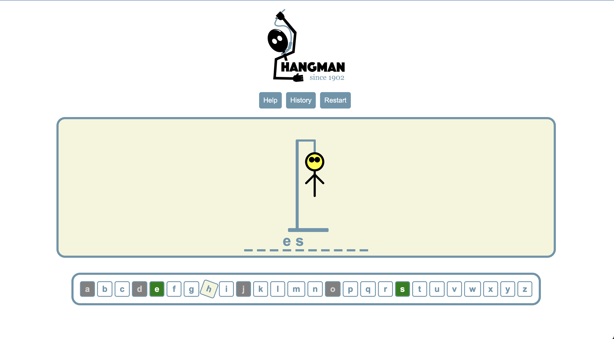

**Hangman Game - React Application**

This project is a Hangman game created using React and Redux.
The game allows users to guess a hidden word, one letter at a time, with a limited number of attempts.

**Features**

   Redux for state management  
   Keyboard and on-screen letter input support  
   Rules and history information  
   Responsive design  

**Installation and Setup**

To install and run the project locally, follow these steps:

   Clone the repository: git clone https://github.com/webdev-sj/hangman-game.git

   Change into the project directory: cd hangman-game

   Install dependencies: npm install

   Start the development server: npm start

   The application should now be running on http://localhost:3000.

**Components**

The application is composed of the following components:

   Header: Displays the header and controls for showing the rules and history.  
   StickFigure: Renders the stick figure based on the number of wrong guesses.  
   GuessWord: Displays the hidden word with correctly guessed letters revealed.  
   Letters: Renders the on-screen letter input buttons and shows used letters.  
   Popup: Displays a modal with the game result and an option to restart the game.  

**Application Structure**

The application is structured as follows:

   App.js: Contains the main application logic, state management, and rendering.  
   redux/: Contains Redux-related files, such as actions and reducers.  
   components/: Contains the React components.  
   App.css: Contains the styling for the application.  

**Contributing**

Contributions are welcome! Please feel free to submit a pull request or open an issue to suggest new features or improvements.

**Licence**

This project is licensed under the MIT License.

